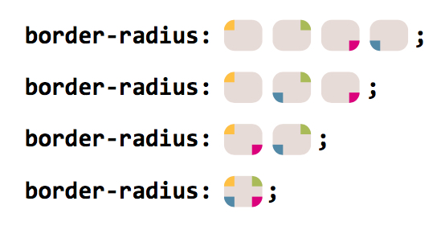

##9.Flexible Ellipses（椭圆）
>主要知识点：border-radius

[border-radius语法](https://developer.mozilla.org/zh-CN/docs/Web/CSS/border-radius)

```js
border-radius: 1em/5em;

/* 等价于 */

border-top-left-radius:     1em 5em;
border-top-right-radius:    1em 5em;
border-bottom-right-radius: 1em 5em;
border-bottom-left-radius:  1em 5em;
border-radius: 4px 3px 6px / 2px 4px;

/* 等价于 */

border-top-left-radius:     4px 2px;
border-top-right-radius:    3px 4px;
border-bottom-right-radius: 6px 2px;
border-bottom-left-radius:  3px 4px;

```



[demo](http://violarong.github.io/cssSecretDemos/3.Shapes/9.FlexibleEllipses.html)

##10.Parallelograms(平行四边形)
>主要知识点：transforms

问题：单纯使用transform:skew,会使文字也跟着倾斜。要解决的问题：使图形倾斜但内容不倾斜

方法1：使用嵌套的元素，子元素以相反方向skew。缺点：多使用了一个html元素

方法2：使用伪元素。伪元素进行变形，内容在父元素上，不受影响。

[demo](http://violarong.github.io/cssSecretDemos/3.Shapes/10.Parallelograms.html)

##11.Diamond images（菱形）
>主要知识点：transforms

问题：视觉经常将图像的展示设计成菱形的效果，要使用css实现该效果比较困难。

方法1：transform-based solution

方法2：Clipping path solution

[demo](http://violarong.github.io/cssSecretDemos/3.Shapes/11.DiamondImages.html)

